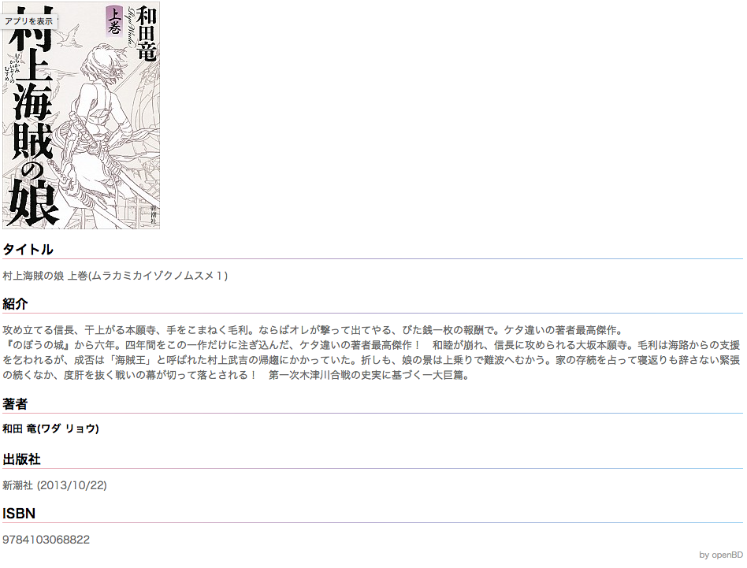

# openBD Chrome Extension

[openBDプロジェクト](https://openbd.jp/)の書誌情報・書影を、対応サイトの本個別ページに表示するChrome用機能拡張です。

## 対応サービス

* [カーリル](https://calil.jp)
* 富士通 iLiswing (例: [https://ilisod001.apsel.jp/kurino-lib/wopc/pc/pages/SearchResultList.jsp](https://ilisod001.apsel.jp/kurino-lib/wopc/pc/pages/SearchResultList.jsp))
* NEC LiCS-Re (例: [http://www.koge-lib.jp/WebOpac/webopac/searchdetail.do](http://www.koge-lib.jp/WebOpac/webopac/searchdetail.do))
* [Amazon](https://www.amazon.co.jp)

## 導入方法

右上の緑色のボタン「clone or Download」から、このリポジトリをクローンするか、zipをダウンロードして解凍します。  
Chromeの設定→拡張機能に行き、右上の「デベロッパーモード」にチェックを入れます。すると、「パッケージ化されていない機能拡張を読み込む」というボタンが出てくるので、それを押します。

さきほど作ったフォルダを選択して開きます。すると、拡張機能がロードされて使える状態になります。

対応サービスの本個別ページを開くと、openBD APIから取得した書誌情報が追加・表示されます。

## ライセンスについて

The MIT License (MIT)

Copyright (c) 2017 CALIL Inc.
